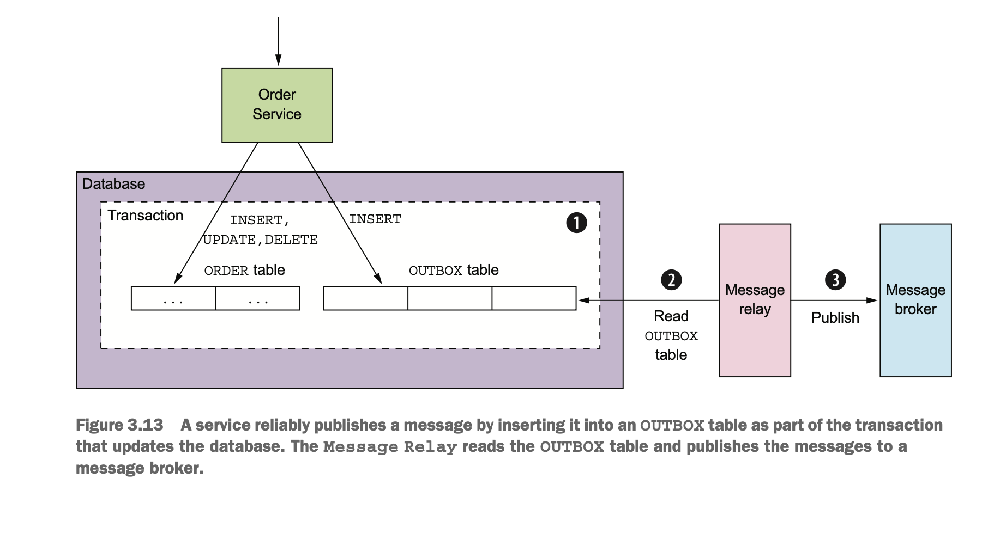

"Transactional messaging" pattern implemented with NestJS/MongoDB/RabbitMQ

## Description



When a Insert/Update/Delete operation come with a message need to be publish immediately right after it, instead of publish to the Message Broker directly, we use DB transaction to perform Insert/Update/Delete operation + write a new `message` record to `outbox` table

"Message Relay" tail DB oplogs related to `outbox` table & publish messages to Message Broker

## Installation

```bash
$ yarn
```

## Dependencies

```bash
$ docker-compose up
```

## Env

Create `.env` file in the root folder & copy content from `sample.env`. Adjust variables to match your RabbitMQ/MongoDB setup

## Running the app

```bash
# development
$ yarn start:dev

# production mode
$ yarn build
$ yarn start:prod
```

## Test

```bash
# unit tests
$ yarn test

# e2e tests
$ yarn test:e2e

# test coverage
$ yarn test:cov
```
